# Predicting Diamond Prices

## Background and Motivation 
Having been recently engaged, I am at the age where everyone else around me is also getting engaged. So I thought it would be a fun project to try and predict diamond prices and along the way, to try and learn more about what dictates a diamond's price (just in case someone comes to me for advice!). 

## Data
Given that [bluenile.com ](https://www.bluenile.com/) has such a huge inventory of diamonds, I figured scraping the website would give me more than enough data to work with. Given that there was an overwhelming amount of round brilliants, I decided to only focus on fancy cut diamonds for this project. Ultimately, there were 52,451 diamonds and 13 features. Given that the website has a lazy loader but only truly loads 1,000 diamonds (despite toggling the "items per page" filter to "all"), I was unable to use selenium to constantly scroll down to refresh and load more diamonds. Instead, I tried again to toggle the "items per page" filter to "24", and iterated through all possible pages to extract the raw html. While, I was able to successfully iterate through all pages, it wasn't until I tried to parse the html that I realized that after the 42nd page, there were no diamond listings being pulled - once again being confined to the first 1,000 diamonds. After some brainstorming, I had finally netted out to a solution that worked and allowed me to pull all current diamond listings. I kept the "items per page" filter toggled to "all" to allow me pull 1,000 diamonds each time. Since there is a price filter, I initially pulled from min price to whatever max price was shown for the first 1,000 diamonds, then each iteration I would change the floor price to the previous max price and kept incrementing until the min price and max price were the same and thus capturing all diamond listings. 

## EDA
As a first step, I plotted the distribution of my target (diamond price) and noticed that it was heavily right skewed and decided to take the log of the price (and eventually predict log price instead of regular price).  
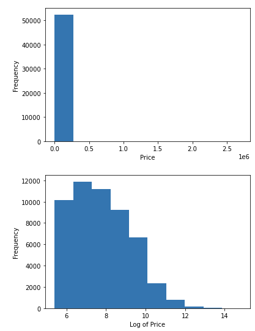

Then I created a scatter matrix to see if there were any immediate relationships we can see between the features.
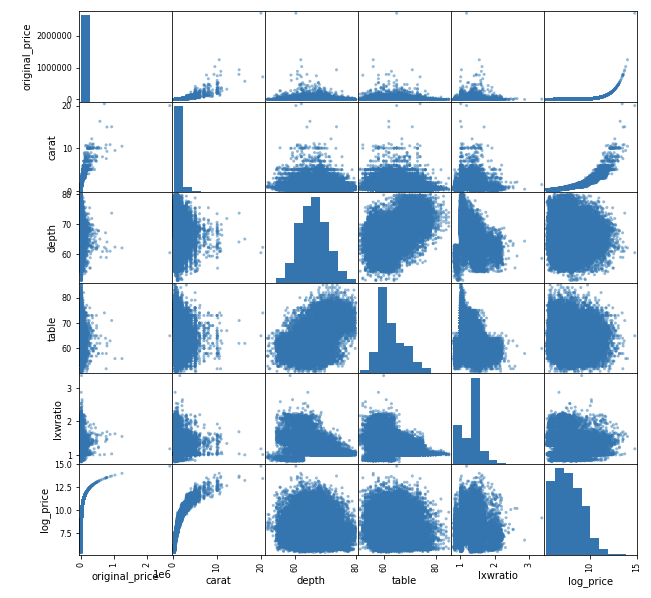  
As we can see, there seems to be a positive linear relationship between price and carat. However, the other features are no so obvious. Also, given that majority of my features are categorical and have some sort of a "ranking" between the values (i.e. symmetry: good, very good, excellent), I decided to try ordinal encoding and create a correlation heatmap. 
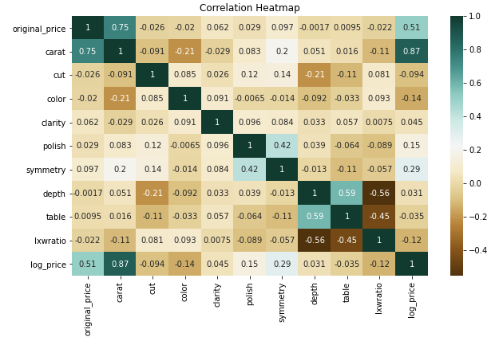  
It is no surprise that carat is highly correlated to price, since we had already seen that in the scatter matrix. As for other added categorical features, there doesn't seem to be much of a linear relationship there. 

## Models and Considerations
The models that I had used were linear regression, random forest, and gradient boosting regressor. With gradient boosting regressor being the best model. 
Seeing that I had a huge range of values (min: $221, max: $2,702,260 ), and the data being so heavily right skewed, I decided to compare models that predicted the original price vs the log of the price. Additionally, given that carats were so highly correlated with price, I decided to use a linear regression predicting base on carats as a quick baseline model.  
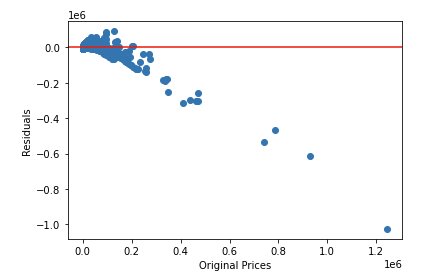  
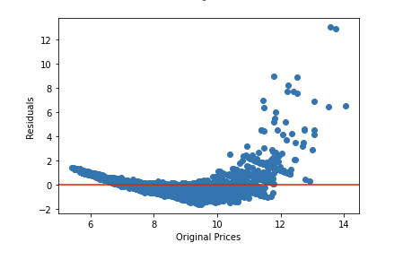  
While taking the log helped a little bit, you can see that there is heteroscedasticity of residuals. Before making amends and rebuilding the model with new predictors. I decided to try the same thing but with a random forest instead first, since random forest tend to perform pretty well out of the box without much tuning to begin with. 
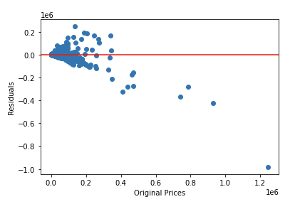  
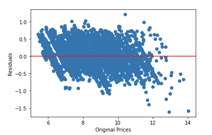  
Luckily, predicting the log of the price with a random forest helped rectify the heteroscedasticity. So I decided to random forest and another ensemble model (gradient boosting regressor). 

After more charts and looking at the gini importance and tweaking my models, the best performance so far netted out at using the standard 4Cs for diamonds (carats,clarity,cut,color). And looking to see if there were any obviously patterns on where our model was consistently over/underestimating - there didn't seem to be any signal there. Our model is simply predicting incorrectly across different diamonds. The charts below are only broken down by clarity, however, the other charts shown consistent findings for other feature breakdowns. 
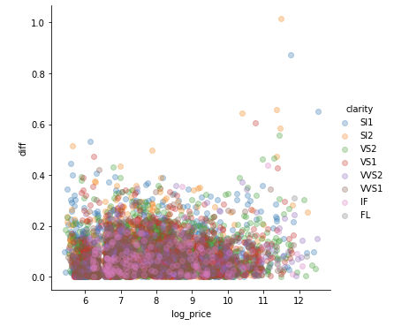  
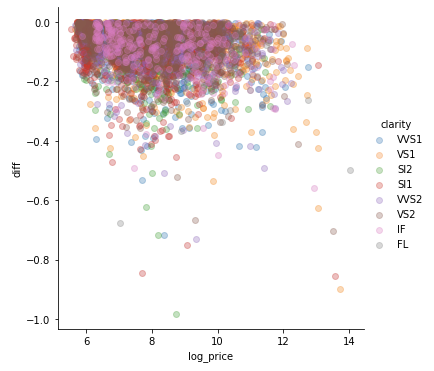  
Having included all prices, our best RMSE was hovering around 10K, and which 10K is not a lot to those looking to purchase a $3,000,000 ring, it is a lot for those on the other end of the spectrum looking at $200 rings.
Ultimately, I decided to filter down my data based on price and carat size to try and get a better performance.  
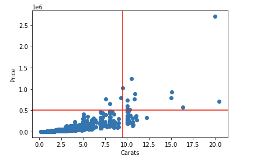  
Only considering diamonds <= $500K and <= 9.5 carats. Again using the 4Cs with gradient boosting regression, we were able to achieve an RMSE of $3,391.

## Looking Forward
Predicting diamond prices proved to be very difficult, especially when comparing smaller diamonds with bigger diamonds. Intuitively speaking, depending on the diamond and the consumer, features are valued differently, i.e. for bigger diamonds you may naturally have to compromise on clarity simply because it is harder to find larger diamonds with little to no flaws, and therefore we might value color more. Additionally, not all flaws are equal, with some being "eye clean" and some affecting the structure of the diamond. Given such, I would love to collect more data and look at additional features such as the comments on a lab report (incorporating NLP)
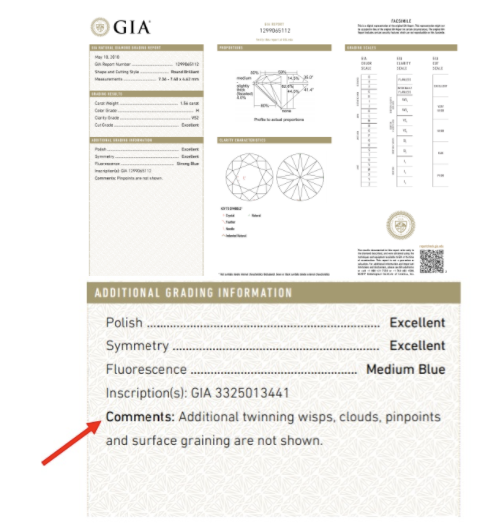  
